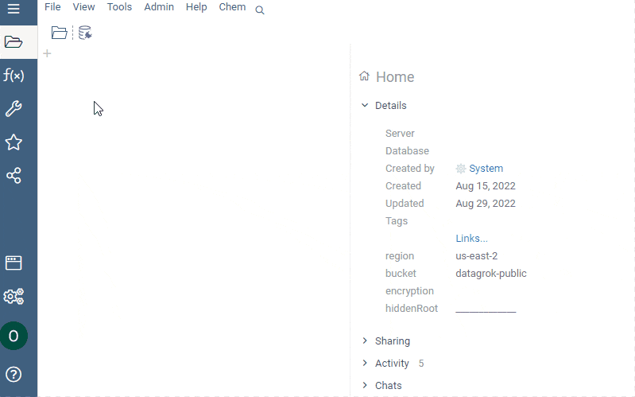

# Databases

In this article:

* [Data access](databases.md/#accessing-databases)
* [Queries](databases.md/#queries)
* Database Manager
* [Managing database connections](databases.md/#managing-database-connections)
* [Managing content within a database
  connection](databases.md/#managing-file-shares)
* [Sharing content](databases.md/#sharing-content)

## Accessing databases

Datagrok lets you access databases in a secure and manageable way.

> Key concept: _database connection_
>
> _Database connection_ is a named connection to the database you access with
> Datagrok. The platform can create a _database connection_ to all the popular
> databases, including PostgreSQL, MySQL, MS SQL, Maria DB, Oracle, and others.
> A _database connection_ allows authorized users to access and query databases.
>
>_Connections_ are Datagrok [entities](../datagrok/objects.md), which means they
>can also be used for sharing data with others and for enabling discovery by
>other Datagrok users.

### Supported connectors

Out-of-the-box, Datagrok provides 30+ connectors to the common databases. For
the full list of supported connectors and required parameters, see [Supported
connectors]( connectors/supported-connectors.md).

> Developers: You can also extend the platform by [creating custom
> connectors](https://github.com/datagrok-ai/public/tree/master/connectors).

### Connect a database

To connect a database, follow these steps:

1. From the main menu on the left, click **Data** > **Databases**.
1. Open the **Add new connection** dialog by either: (1) expanding the
   **Actions** panel and clicking **Add new connection…**, or (2) Right-clicking
   the appropriate connector in the tree, and choosing **Add connection…**.
1. From the **Data Source** dropdown list, select the desired database when
   prompted. This updates the dialog with connection-specific parameter fields.
1. Fill in all dialog fields displayed.

>Notes:
>
> If the connection requires a custom JDBC connection string, fill in the
> parameter **Conn. string**. In this case, you don’t need to fill in other
> parameters except for **Login** and **Password**.
>
>You can enter _credentials_ (typically, login/password) manually. When entered
>manually, Datagrok stores secrets in a secure [privilege management
>system](/govern/security.md/#credentials). You can also set up a connection
>using Datagrok's integration with the AWS Secrets Manager (see [Secrets
>Managers](/access/data-connection-credentials.md/#secrets-managers) for
>details).
>
>To define who can change the connection credentials, make a selection from the
>**Credential owner** dropdown.

1. Click **TEST** to the connection, then click **OK** to save it.

## Queries

* [Query a database](databases.md/#query-a-database):
  * Write a SQL query
  * Create an aggregation query
  * Build a query for multiple tables
* [Parametrize query](databases.md/#parameterize-a-query)
* [Postprocess query results](databases.md/#postprocess-query-results)

### Query a database

Once you connected a database, you can start querying it. To see a full list of
available options, right-click the table. Alternatively on the **Property
pane**, either click the drop-down arrow next to the table name or expand the
**Actions** info panel.

GIF

Subject to your permissions, you can choose to:

* Retrieve all data (**Get All**).
* Retrieve the first 100 rows (**Get TOP 100**).
* [Write a SQL query](databases.md/#write-a-sql-query) (**New SQL Query…**).
* [Aggregate data via query](databases.md/#aggregate-data-via-query) (**Visual
  Query…**).
* [Join tables](databases.md/#join-tables) (**Build Query…**).

#### Write a SQL query

To query a table manually, follow these steps:

1. From the table's context menu, click **New SQL Query…**. The **Query View**
   opens.
1. In the **Query View**, write the SQL query.
1. When finished, enter the query name. Then on the **Menu Ribbon**, click
   **Save** to save the query to the Datagrok server.

#### Aggregate data via query

To aggregate a table data, follow these steps:

1. From the table's context menu, click **Visual Query…**. This action opens
   the **Visual Query** form.
1. To calculate an aggregate value of the column, add this column to the
   **Measures** section:

   * Click the **Add an aggregation** icon next to **Measures**. This opens the
     context menu.
   * In the first row of the context menu, choose the aggregation type.
     >Note: out-of-the-box the list of aggregation types contains the Datagrok
     >standard aggregation functions and may contain custom aggregation
     >functions exposed by the database provider. For exapmle, Datagrok exposes
     >Postrges database GIS (Geo Information System) functions.
   * Choose the column to aggregate. Datagrok automaticaly shows the result of
     the query in the dataframe below.
      > Note: You can change the aggregation parameter by right-clicking it and
      > selecting the new aggregation type and column.

1. To group query results by column values, add this column to the **Rows**
   section by clicking the **Add column to group the rows on** icon next to
   **Rows**. <!--You can use more than one column as a key.-->
1. To substitute the column values into the resulting columns, add this column
   to the **Columns** section by clicking the **Add column to pivot on** icon
   next to **Columns**.
1. When finished, enter the query name. Then on the **Menu Ribbon**, click
   **Save** to save the query to the Datagrok server.

GIF

#### Join tables

Datagrok detects the schema of the database. When you open a table in **Query
builder**, the platform automaticaly displays all the tables connected to it by
the foreign keys.

To join tables, follow these steps:

1. From the table's context menu, click the **Build Query…**. This action opens
   the  a **Query builder** dialog.
1. Select columns of the tables and combine them with the other tables'
   columns.

The result of the query appears instantaneously. And at any stage of building
the query, you can add the results to the workspace. To do that, follow these
steps:

1. At the bottom of the **Query builder** window, click the context menu icon.
1. Click **Add results to workspace**. The results appear in the dataframe in
   the workspace.

To save a query to the Datagrok server, follow these steps:

1. At the bottom of the **Query builder** window, click the context menu icon.
1. Click **Save as query**. This opens a **Query View** window.
1. Enter the query name.
1. On the **Menu Ribbon**, click **Save**.

GIF

### Parameterize a query

### Postprocess query results

## Database Manager

## Managing database connections

## Managing content within a database connection

## Sharing content

See also:

## Resources
