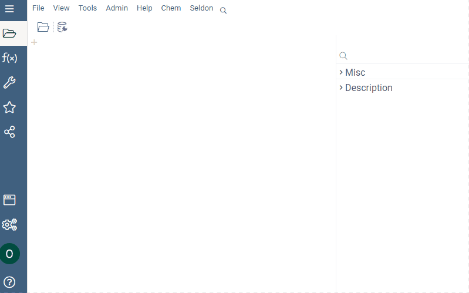
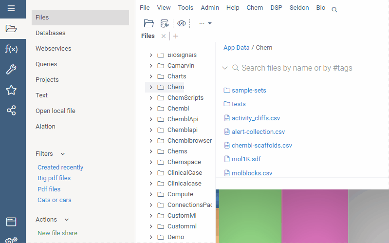
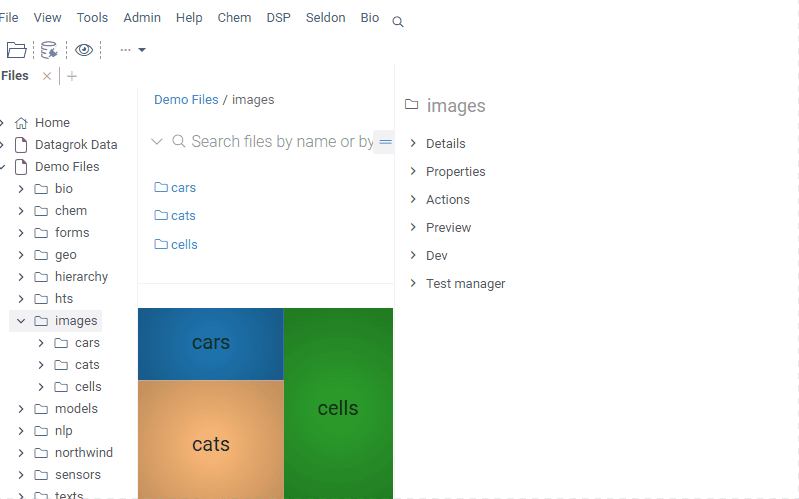

# File manager

## Overview

Datagrok file manager is similar to a common file browser but more interactive
with data. You can preview file content, see its properties on the content
driven property panel, obtain data analytics and summary statistics in tooltips,
and filter data right in the overview window. Besides, the file manager
instantly renders smiles as molecules.

The Datagrok platform can run applications that simplify data recognition and
search right from the file manager. For example, the [Clinical Case](https://github.com/datagrok-ai/public/tree/master/packages/ClinicalCase#readme) is an
application for exploring clinical data represented in SDTM format. It
automatically detects if there is a file with SDTM format data in the folder you
open and prompts you to use the Clinical Case package.

Also, Datagrok supports Scripts that can process data without opening the file.
Such scripts are convenient for data science teams that actively work with
files. All you need is to write an executable script in any programming language
and connect it to the Datagrok platform. Now you can analyze data right where it
is stored or whenever you can find it. You don’t need to upload or open files.
Instead, select the file in the Datagrok file manager, and if the data is
suitable for processing by the script, you receive the result in a preview. For
example, the Cell Imaging Segmentation script segmentates cells in the image and
counts their number. You can see the results of such processing in the preview
section of the property panel.

File manager is associated with a workspace that provides interactive data
processing dashboards.

## Load a file

Datagrok supports the most popular data formats, such as CSV, TXT, JSON, and
others, including [tabular and molecular structure](file.md) ones. To load a local file,
drag and drop it into the Datagrok workspace. The platform highlights the area
where to place it.

To load a file from remote storage, create a new file share:

GIF

### Credentials

When connecting to external storage that may belong to another organization,
DataGrok supports the current differentiation of user access rights by using
their credentials. So a single organization's file connection may keep multiple
users’ credentials. In this case, when creating a new file share, the user must
use the given login and password as access and secret keys.

## Refresh a file

Datagrok remembers all the file connections and can reproduce any of them while
loading files. So to get a current file copy, refresh the file; no additional
connection is needed. The local host loading is the only exception because, in
this case, Datagrok doesn't create an actual connection.

## Share a file

In Datagrok, you can share all the opened files or choose the files you want to
share from those accessible to you. Also, you can assign privileges and access
rights to each user or group you share with.

GIF
