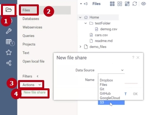
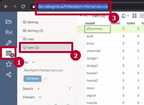

# File manager

This document focuses on the Datagrok file manager features for working with
files. This document doesn't describe working with databases and open API web
services.

## Common file browser

The Datagrok file manager allows you to operate the file system just like your
regular file system browser:

* It has a hierarchical tree of directories
* The files could be dragged and dropped from your desktop to the Datagrok file
  manager
* You can right-click the file and see available actions
* You can browse, preview, open, download, share, move, rename files, etc.

## File format

Datagrok file manager works natively with the most popular data formats, such as
CSV, TXT, JSON, and others, including [tabular and molecular
structure](https://datagrok.ai/help/access/file) ones.

## Access

Datagrok provides access to anything that is machine-readable:

* Most file formats
* All sorts of databases: relational, non-relational, and NoSQL
* Open API web services
* Scripts and functions

The file manager connects the Datagrok persistent file storage and can easily
create new connections to access any file from within Datagrok storage:

* Dropbox
* Files
* Git
* GitHub
* Google Cloud
* S3

## Science-aware environment

Datagrok is a data agnostic, domain-intelligent, interactive science-aware
environment. That’s why file manager constantly provides you with information
about a file and its content:

* Interacts with the dataset right from the overview window
* Recognizes data domain to render it properly
* Has content-driven property pane
* Gives tooltips and summary statistics

Applications can run right from the file manager. For example, the [Clinical
Case
package](https://github.com/datagrok-ai/public/tree/master/packages/ClinicalCase#readme)
automatically detects clinical data in the folder and offers relevant tools.

[Scripts](https://datagrok.ai/help/compute/scripting) can preprocess data in
file manager: the **Cell Imaging Segmentation** script makes segmentation and
counts the number of cells in the image.

Such scripts are convenient for data science teams that actively work with
files. Now you can analyze data right where it is stored. All you need is to
write an executable script in any programming language and connect it to the
Datagrok platform.

File manager is associated with a workspace that provides interactive data
processing dashboards.

## Learn how to

* [Load a file from:](#load-a-file)
  * [Local host](#from-local-host)
  * [Remote file storage:](#from-remote-file-storage)
  * [**Home** folder or other accessible folder in Datagrok](#from-home-folder)
* [Keep data up to date](#refresh-a-file)
* [Share a file as:](#share)
  * [Data table](#share-a-data-table)
  * [File](#share-a-file)
* [Upload processed data](#upload-a-project)

<!--See useful features:

* [Dashboard](#dashboard)
* [Clinical case](#clinical-data)
* [Scripts](#scripts)-->

## Load a file

Learn the steps to load a file from different types of storage.

### From local host

To load a local file, drag and drop it into the Datagrok workspace. The platform
highlights the area where to place it.

### From remote file storage

To support the differentiation of user access rights of other organizations,
Datagrok supports their credentials. So a single organization's file connection
may support multiple users’ credentials. In this case, when creating a new file
share, the user must use the given login and password as access and secret keys.

To load a file, you need to connect the file storage. To do that, create a new
file share:

* _Step 1._ In the left side panel, select  icon >**Files** > **Actions** >
  **New File Share**.

* _Step 2._ In the new dialog, select **Data Source** from the dropdown list and
fill in the required fields. To load the file, doubleclick it.

### From **Home** folder

Every user in Datagrok has a **Home** folder. It is the user's personal file
storage.

To access the **Home** folder in the left side panel, select  icon > **Files**.
The Home folder is the first in the middle panel.

To load from the **Home** folder, doubleclick the required file.

**NOTE:** Datagrok operates the Home folder as a regular connection.

### Refresh a file

Datagrok remembers all the file connections while loading files and can
reproduce any of them. So to get a current file copy, refresh the file; no
additional connection is needed. The local host loading is the only exception
because, in this case, Datagrok doesn't create an actual connection.

To refresh the file in the left side panel, select icon >**File** > **REFRESH**.

<!--## Working with data features

### Clinical data

### Scripts

### Dashboard

Once you upload the file, the platform recognizes the data and offers tools for data processing-->

## Share

In Datagrok, you can share all the opened files or choose the files you want to
share from the ones accessible to you. Also, you can assign [privileges and
access rights](https://datagrok.ai/help/govern/security) to each user or
[groups](https://datagrok.ai/help/govern/group) you share with.

### Share a data table

To share the opened file as a data table in the left side panel, select  icon >
**File** >  icon.

**NOTE:** Datagrok shares all the files opened in the project while choosing the
data table form to share.

When turning on **Data sync**, data reloads when a user opens the project.

### Share a file

Datagrok doesn’t share files directly. To share a file:

* _Step 1._ Open connection to the file directory:

1. In the left side panel, select  icon > **Files**.
2. Right-click the file.
3. Select **Share**.

In the opened dialog you can choose to share the **Home** folder or to create a
new connection to the file directory itself.

**NOTE:** We don’t recommend sharing the Home folder.

* _Step 2._ Copy the link to the file and send it to the user or the group you
want to share with. To copy the link in the opened dialog, select icon.

**NOTE:** you can also copy the file URL from the address bar, when the file is
opened:

1. In the left side panel, select  icon.
2. Choose the file.
3. Copy its URL from the address bar.

## Upload a project

After processing the data, file manager allows to upload current project to the
server.

To upload the project in the left side pannel, select **Projects** icon >
**UPLOAD**.

When turning on **Data sync**, data reloads when a user opens the project.

After saving the project, you can set user previleges to the project.

<!---->
