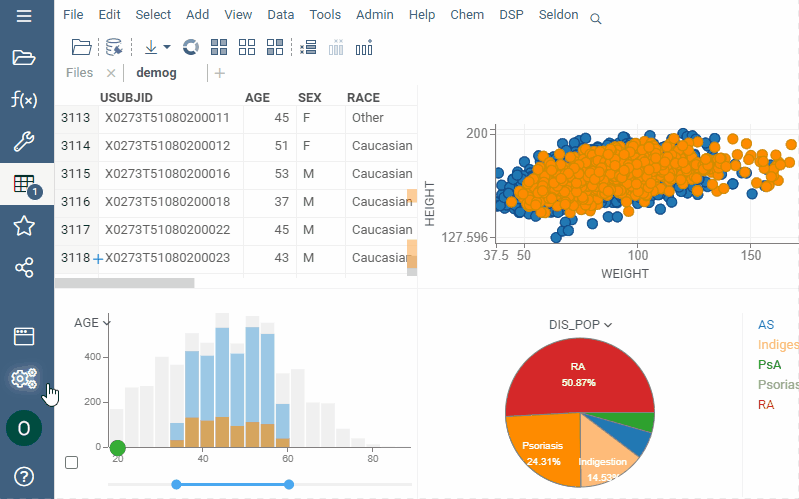

# Upload project

While working with data, Datagrok doesn’t make any data copies and performs all
manipulations in the browser without involving the server. So your project
resides only in your browser until you upload it to the server.

Upload with data synchronization (**Data sync** is on) if you want to retrieve
the latest view of the data you’ve entered when you (or the user you might share
with) open the project next time. In this case, the platform doesn’t save the
data itself but the connection to the initial data source and the
[function](../overview/functions/function.md) by which the data was obtained.

Upload without data synchronization (**Data sync** is off) if you want to save
or share the static data.

Turn on **Presentation mode** to view or share the project without side panels.
**F7** helps to switch between presentation and design modes.

By default, you are your project's owner and the only person who can see it. You
can share the project with any user or group while uploading the project or any
time later. Once you share the project, your addressee gets an email with a
direct link to the project.

