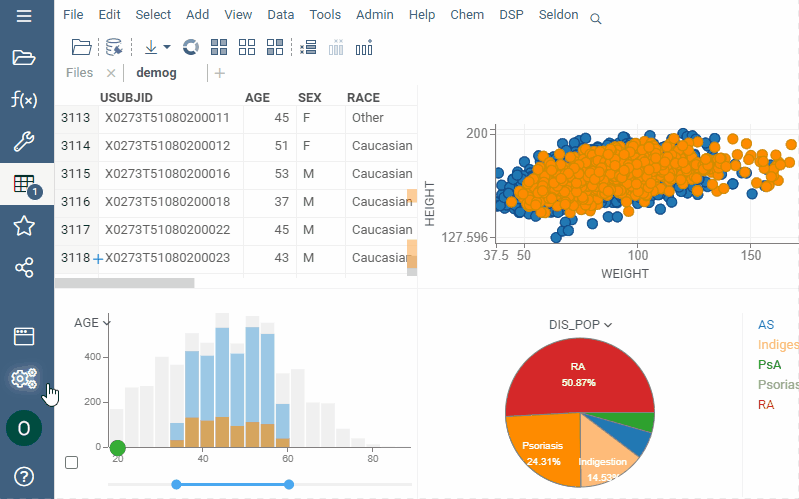

<!-- TITLE: Project -->
<!-- SUBTITLE: -->

# Project

Project is a collection of entities along with the applied visualizations. It can contain [tables](table.md), [queries](../access/data-query.md),
[connections](../access/data-connection.md), [data jobs](../access/data-job.md),
[Jupyter notebooks](../compute/jupyter-notebook.md)
, [predictive models](../learn/predictive-modeling.md), and other. Use projects to group and
share your data work with others.

## Upload a project

While working with data in [workspace](workspace.md), Datagrok doesn’t make any
data copies and performs all manipulations in the browser without involving the
server. So your project resides only in your browser until you upload it to the
server.

### Dynamic data

Upload with data synchronization (**Data sync** is on) if you want to retrieve
the latest view of the data you’ve entered when you (or the user you might share
with) open the project next time. In this case, the platform doesn’t save the
data itself but the connection to the initial data source and the
[function](../overview/functions/function.md) by which the data was obtained.

Upload without data synchronization (**Data sync** is off) if you want to save
or share the static data.

Turn on **Presentation mode** to view or share the project without side panels.
**F7** helps to switch between presentation and design modes.

## Share a project

By default, you are your project's owner and the only person who can see it. You
can share the project with any user or group while uploading the project or any
time later. Sharing a project shares all entities and data inside. Once you
share the project, your addressee gets an email with a direct link to the
project.

<!--Or, if you are editing an existing project, click `SAVE` to save your changes.-->

## Project types

The platform organizes projects in a tree structure. This hierarchy determines
the order of rights inheritance on particular [entities](objects.md) There are
two main types of projects: _root_ and _regular_. Root projects can contain one
or more non-root projects. For example, the link  **Demo:CoffeeCompany**
indicates that the **CoffeeCompany** project is a part of the root project
**Demo**. Any link to an entity on the platform starts with the root project.
And since an entity can have only one canonic address, other related projects
reference the link rather than the entity itself. This fact becomes important in
the context of regular projects. As the name suggests, they are the most common
ones (that's what users create by default). Entities from such a project belong
to the higher-level namespace, which means they are tied to the root project. To
find out where an entity comes from, see **Links** in the **Details** tab of the
property panel. Users and packages automatically create root projects. When you
upload a project, it gets saved to your namespace. However, you can access the
existing entities in the project via a link. As for packages, each version has
its own project, so that you can share packages on a version level.

## Project gallery

Browse projects that are available to you. Use [Smart search](smart-search.md)
for powerful filtering capabilities.

To control sort order and access your recent searches, select the context menu
left of the search box.

Controls:

|              |                        |
|--------------|------------------------|
| Click        | Show in property panel |
| Right click  | Context menu           |
| Double click | Open                   |

## Filtering

To filter projects with [smart search](smart-search.md) use  the following fields:

| Field        | Description                                 |
|--------------|---------------------------------------------|
| name         |                                             |
| description  |                                             |
| createdOn    |                                             |
| updatedOn    |                                             |
| author       | [User](../govern/user.md) object            |
| starredBy    | [User](../govern/user.md) object            |
| commentedBy  | [User](../govern/user.md) object            |
| usedBy       | [User](../govern/user.md) object            |

See also:

<!--* [Create project](create-project.md)-->
* [Data pipeline](../access/data-pipeline.md)
* [Data connection](../access/data-connection.md)
* [Data query](../access/data-query.md)
* [Data job](../access/data-job.md)
* [Function call](functions/function-call.md)
<!--* [Projects tutorial](../_internal/tutorials/projects.md)-->
